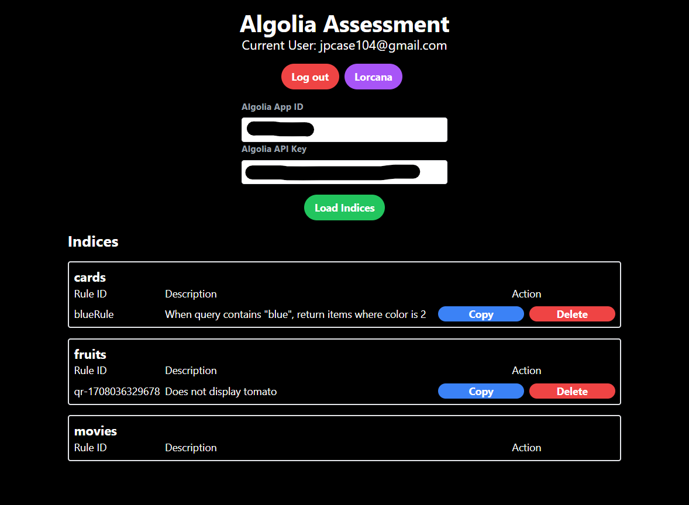

# Algolia Asssessment JC



## Getting Started
You can find a live demo of the project [here](https://algolia-assessment.vercel.app/)!


### Local Setup
1. `git clone https://github.com/Case104/algolia-assessment.git`
2. Run `npm install` to install the dependencies
3. Create a `.env.local` file in the root of the project and add the following environment variables:
```
AUTH_GITHUB_ID=
AUTH_GITHUB_SECRET=
NEXT_PUBLIC_ALGOLIA_APP_ID=
NEXT_PUBLIC_ALGOLIA_API_KEY=
```
4. Run `npm run dev` to start the development server
5. Open `http://localhost:3000` in your browser

## Features
- Authentication with GitHub
- Initialize Algolia Client
- Display Indices and Rules
- Copy Rules from one index to another
- Delete Rules
- Load cards into Index
- Search card attributes
- Deployed to Vercel

## Musings

### How did you interpret and understand the assignment?
I interpreted the assignment by breaking it down into its core components: creating a Next.js application using page router with Algolia's search functionality, integrating authentication, and facilitating rule copying between indices. To thoroughly understand Algolia's context and terminologies, I immersed myself in the documentation and tutorials. My hands-on engagement with the API, particularly by importing and manipulating data from a Disney-themed card game, Lorcana, was instrumental. This direct interaction with Algolia's search features deepened my comprehension and shaped my approach to crafting the solution.

### What ideas and/or solutions were you evaluating?
In evaluating potential solutions, I weighed the benefits of integrating established libraries—such as react-query, react-hook-form, and various UI component libraries—against the merits of developing custom implementations. Libraries promised a quick route to a polished UI and enhanced user experience, featuring animations and validations. However, building custom solutions presented a unique opportunity to demonstrate my competency with the foundational elements of JavaScript and React, emphasizing my technical depth and independence from third-party abstractions.

### Why did you ultimately choose the solution that you implemented?
The solution I chose reflects a balanced consideration of the assignment's demands, an opportunity to showcase my technical expertise, and my personal engagement with the project. By employing custom hooks and leveraging the Next.js API, I was able to effectively manage state and data flow, demonstrating strong web development fundamentals. This method not only satisfied the assignment's requirements but also served as a platform for demonstrating my technical abilities and innovative and fun approach.
